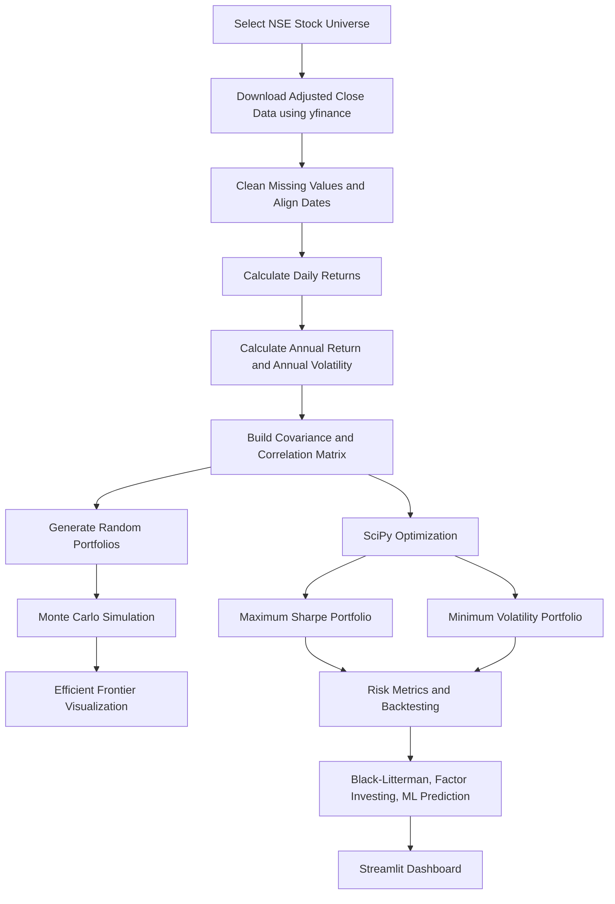
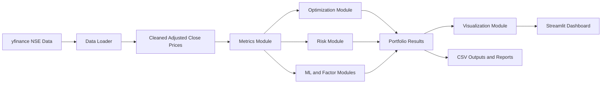

# Advanced Portfolio Optimization Using Modern Portfolio Theory and Python

## 1. Title Page

**Project Title:** Advanced Portfolio Optimization Using Modern Portfolio Theory and Python  
**Project Brand:** NiveshMatrix  
**Project Name:** Advanced_Nse_Portfolio_Optimizer  
**Domain:** Finance, Data Science, Portfolio Management, Python Application Development  
**Submitted By:** [Student Name]  
**Roll Number:** [Roll Number]  
**Course / Department:** [Course / Department Name]  
**College / University:** [College / University Name]  
**Submitted To:** [Guide / Faculty Name]  
**Academic Year:** [Academic Year]  

---

## 2. Abstract

This project, **Advanced Portfolio Optimization Using Modern Portfolio Theory and Python**, is a finance and data science application built for analyzing and optimizing a portfolio of Indian NSE stocks. The project uses historical stock market data collected through the `yfinance` Python library. The analysis is based mainly on Adjusted Close prices, because adjusted prices reflect the effect of corporate actions such as dividends and stock splits more appropriately than raw close prices.

The project calculates daily returns, annual expected returns, annual volatility, covariance matrix, and correlation matrix. It then applies multiple portfolio construction techniques, including equal-weight allocation, random portfolio generation, Monte Carlo simulation, Efficient Frontier visualization, Maximum Sharpe Ratio optimization, and Minimum Volatility optimization using SciPy. The project also includes advanced modules such as risk analytics, walk-forward backtesting, Black-Litterman model, factor investing, and machine learning based return prediction.

The final output is presented through a Streamlit dashboard. The dashboard uses a pure black background, pure white text, pure green for profit or positive indicators, and pure red for loss or negative indicators. The project is designed for educational use, college submission, and demonstration of practical applications of finance theory using Python.

This project does not claim to guarantee profits. All calculations are based on historical data and mathematical assumptions. The results should be interpreted as analytical support, not as direct investment advice.

---

## 3. Introduction

Portfolio management is the process of selecting a group of financial assets in order to balance return and risk. Investors generally want higher returns, but higher returns are often associated with higher risk. A scientific portfolio management system should therefore consider both return and risk instead of focusing only on expected profit.

Modern Portfolio Theory, introduced by Harry Markowitz, provides a mathematical framework for portfolio selection. It explains that the risk of a portfolio depends not only on the risk of individual assets but also on how those assets move together. This relationship is measured through covariance and correlation. A properly diversified portfolio can reduce unsystematic risk by combining assets whose returns are not perfectly correlated.

In this project, Modern Portfolio Theory is implemented using Python. The project focuses on Indian NSE stocks and performs data collection, cleaning, return calculation, risk calculation, optimization, backtesting, and dashboard visualization. It also extends the basic MPT framework by adding advanced risk metrics, Black-Litterman allocation, factor investing, and machine learning return prediction.

The main aim of this project is to show how financial theory can be converted into a working data application. It also demonstrates how Python libraries such as pandas, NumPy, SciPy, scikit-learn, Matplotlib, Seaborn, yfinance, and Streamlit can be combined to create an end-to-end portfolio optimization system.

---

## 4. Problem Statement

Many investors choose stocks based on simple price movement, news, tips, or past returns. This approach may ignore risk, diversification, correlation, drawdowns, and changing market conditions. A stock that gives a high return may also have high volatility. Similarly, a portfolio with many stocks may still be risky if all stocks move in the same direction during market stress.

The problem addressed in this project is:

**How can a Python-based system analyze Indian NSE stocks and construct optimized portfolios by considering return, risk, diversification, and risk-adjusted performance?**

The project attempts to solve this problem by building a portfolio optimization tool that:

- Collects historical NSE stock data.
- Cleans and processes Adjusted Close prices.
- Calculates return and risk measures.
- Generates random portfolios.
- Simulates many portfolio combinations.
- Identifies efficient risk-return portfolios.
- Optimizes for Maximum Sharpe Ratio and Minimum Volatility.
- Evaluates strategies using advanced risk metrics and backtesting.
- Presents results in an interactive dashboard.

---

## 5. Objectives

The main objectives of the project are:

1. To collect historical data for selected Indian NSE stocks using `yfinance`.
2. To use Adjusted Close prices for accurate return calculation.
3. To clean missing values and prepare reliable time-series data.
4. To calculate daily returns, annual returns, annual volatility, covariance matrix, and correlation matrix.
5. To generate a random portfolio and evaluate its performance.
6. To run Monte Carlo simulation for many random portfolios.
7. To visualize the Efficient Frontier.
8. To optimize the portfolio for Maximum Sharpe Ratio using SciPy.
9. To optimize the portfolio for Minimum Volatility using SciPy.
10. To calculate advanced risk metrics such as Sortino Ratio, Maximum Drawdown, VaR, and CVaR.
11. To perform backtesting for realistic historical performance evaluation.
12. To implement Black-Litterman model for view-based portfolio allocation.
13. To include factor investing based on factor proxies such as momentum, volatility, value, quality, and size.
14. To experiment with machine learning based return prediction.
15. To build a clean Streamlit dashboard for visualization and user interaction.
16. To structure the project professionally for GitHub and college submission.

---

## 6. Scope of the Project

The scope of this project is limited to educational portfolio analysis and optimization using historical data. The project uses Indian NSE stocks and focuses on quantitative methods. It can be used to understand how portfolio theory works and how Python can be used for financial modeling.

The project includes:

- Indian NSE stock universe.
- Historical price data collection through yfinance.
- Adjusted Close price based return calculation.
- Return and risk analysis.
- Covariance and correlation analysis.
- Random portfolio generation.
- Monte Carlo simulation.
- Efficient Frontier visualization.
- SciPy-based constrained optimization.
- Maximum Sharpe Ratio and Minimum Volatility portfolios.
- Advanced risk analytics.
- Backtesting.
- Black-Litterman model.
- Factor investing.
- Machine learning return prediction.
- Streamlit dashboard.

The project does not include:

- Live trading execution.
- Real broker API integration.
- Guaranteed investment signals.
- Personalized financial advice.
- Real-time tax calculation.
- Complete professional-grade risk compliance.

---

## 7. Literature Review

### 7.1 Modern Portfolio Theory

Modern Portfolio Theory was introduced by Harry Markowitz in his 1952 paper *Portfolio Selection*. The main idea is that portfolio risk should be measured at the portfolio level, not only at the individual stock level. The theory explains that diversification can reduce risk when assets are not perfectly correlated.

MPT uses expected return, variance, covariance, and optimization to identify efficient portfolios. An efficient portfolio is one that offers the highest expected return for a given level of risk, or the lowest risk for a given expected return.

### 7.2 Efficient Frontier

The Efficient Frontier is a curve representing optimal portfolios in the risk-return space. Portfolios below the frontier are less efficient because another portfolio may provide higher return for the same risk or lower risk for the same return. In this project, Monte Carlo simulation is used to generate many random portfolios and visualize the risk-return distribution.

### 7.3 Sharpe Ratio

The Sharpe Ratio, introduced by William F. Sharpe, measures risk-adjusted return. It compares the excess return of a portfolio over a risk-free rate to the portfolio volatility. A higher Sharpe Ratio generally indicates better return per unit of risk, but it should not be used alone because it assumes volatility is a suitable risk measure.

### 7.4 Sortino Ratio

The Sortino Ratio improves upon the Sharpe Ratio by focusing on downside volatility instead of total volatility. This is useful because investors are usually more concerned about losses than positive fluctuations.

### 7.5 Black-Litterman Model

The Black-Litterman model combines market equilibrium returns with investor views. It is useful because traditional mean-variance optimization can be very sensitive to expected return assumptions. However, Black-Litterman results depend on the quality and confidence of the views used.

### 7.6 Factor Investing

Factor investing studies drivers of return such as momentum, value, quality, size, and low volatility. This project uses factor proxies where reliable data is available. Since free Indian fundamental data may be incomplete, missing values are handled carefully.

### 7.7 Machine Learning in Finance

Machine learning can be used to predict future returns using historical features such as momentum, volatility, moving average ratios, and technical indicators. However, stock return prediction is difficult because financial markets are noisy and affected by many unknown factors. Therefore, the ML section is treated as an experiment, not as a guaranteed prediction engine.

---

## 8. Technology Used

### 8.1 Programming Language

**Python** is used because it has strong libraries for finance, data analysis, numerical computing, machine learning, visualization, and web dashboards.

### 8.2 Libraries

| Technology | Purpose |
| --- | --- |
| Python | Main programming language |
| yfinance | Historical stock price data collection |
| pandas | Data cleaning, time-series handling, returns, tables |
| NumPy | Numerical operations and vectorized calculations |
| SciPy | Portfolio optimization using constrained minimization |
| Matplotlib | Chart generation |
| Seaborn | Correlation heatmap and statistical visualization |
| scikit-learn | Machine learning return prediction experiment |
| Streamlit | Interactive dashboard |
| Git and GitHub | Version control and project submission |

### 8.3 Development Structure

The project has been structured as a modular Python project:

```text
Advanced_Nse_Portfolio_Optimizer/
|-- app.py
|-- config.py
|-- requirements.txt
|-- assets/
|-- data/
|-- reports/
|-- src/
|-- legacy/
`-- README.md
```

The Streamlit dashboard imports functions from the `src` folder instead of keeping all logic inside one large file. This makes the project easier to read, test, maintain, and explain.

---

## 9. Dataset Description

### 9.1 Data Source

The project uses historical stock price data collected through the `yfinance` Python library. The selected universe consists of Indian NSE-listed stocks with the `.NS` suffix.

Examples:

- RELIANCE.NS
- TCS.NS
- INFY.NS
- HDFCBANK.NS
- ICICIBANK.NS
- SBIN.NS
- LT.NS
- ITC.NS

### 9.2 Price Field Used

The project uses **Adjusted Close** price wherever available. Adjusted Close is preferred because it accounts for corporate actions such as stock splits and dividends. If adjusted data is unavailable, the system can use close prices as a fallback with suitable caution.

### 9.3 Data Frequency

The project uses daily price data. Daily returns are calculated from consecutive trading days.

### 9.4 Data Cleaning

Data cleaning includes:

- Removing stocks with too many missing values.
- Forward filling and backward filling small gaps.
- Dropping rows or columns that remain unusable.
- Ensuring that at least enough trading observations are available.
- Aligning all selected stocks to the same date index.

### 9.5 Important Assumptions

- There are approximately 252 trading days in a year.
- Historical average return is used as a proxy for expected return.
- Historical covariance is used as a proxy for future covariance.
- The selected risk-free rate is configurable.
- Results depend on selected tickers and date range.

---

## 10. Methodology

The project follows a structured methodology:

### 10.1 Methodology Flow

1. **Data Collection**  
   Historical NSE stock price data is downloaded using yfinance.

2. **Data Cleaning**  
   Missing values are handled and unusable stocks are removed.

3. **Return Calculation**  
   Daily returns are calculated from Adjusted Close prices.

4. **Risk Calculation**  
   Annual volatility, covariance matrix, and correlation matrix are calculated.

5. **Random Portfolio Generation**  
   A random set of stock weights is created and evaluated.

6. **Optimization**  
   SciPy optimization is used to find Maximum Sharpe Ratio and Minimum Volatility portfolios.

7. **Backtesting**  
   Portfolio strategies are evaluated using historical returns to understand past behavior.

8. **Dashboard Visualization**  
   Results are displayed in an interactive Streamlit dashboard.

### 10.2 Process Diagram



---

## 11. Mathematical Formulas

This section explains the main formulas used in the project.

### 11.1 Daily Return

Daily return measures the percentage change in stock price from one trading day to the next.

```text
r_t = (P_t - P_(t-1)) / P_(t-1)
```

or:

```text
r_t = (P_t / P_(t-1)) - 1
```

Where:

- `r_t` = daily return on day `t`
- `P_t` = Adjusted Close price on day `t`
- `P_(t-1)` = Adjusted Close price on previous trading day

If a stock price increases from 100 to 105, daily return is:

```text
(105 / 100) - 1 = 0.05 = 5%
```

### 11.2 Annual Return

Annual expected return is calculated by multiplying average daily return by the approximate number of trading days in a year.

```text
Annual Return = Mean Daily Return * 252
```

Where:

- `252` = approximate number of trading days in one year

This is a simple annualized estimate. It is useful for comparison, but it is still based on historical average returns.

### 11.3 Annual Volatility

Volatility measures the variation or uncertainty in returns. Annual volatility is calculated by scaling daily standard deviation by the square root of trading days.

```text
Annual Volatility = Standard Deviation of Daily Returns * sqrt(252)
```

Where:

- Standard deviation measures variation in daily returns.
- `sqrt(252)` annualizes daily risk.

Higher volatility means the stock or portfolio has had larger return fluctuations.

### 11.4 Covariance Matrix

Covariance measures how two assets move together.

```text
Cov(X, Y) = Sum[(X_i - Mean_X)(Y_i - Mean_Y)] / (n - 1)
```

Where:

- `X` and `Y` are return series of two stocks.
- Positive covariance means the assets generally move together.
- Negative covariance means they often move in opposite directions.

In portfolio optimization, the covariance matrix is important because portfolio risk depends on both individual asset risk and relationships between assets.

### 11.5 Correlation Matrix

Correlation standardizes covariance into a value between -1 and +1.

```text
Correlation(X, Y) = Cov(X, Y) / (Std_X * Std_Y)
```

Where:

- `+1` means perfect positive relationship.
- `0` means no linear relationship.
- `-1` means perfect negative relationship.

Correlation helps identify diversification benefits.

### 11.6 Portfolio Return

Portfolio return is the weighted average of the expected returns of all assets.

```text
R_p = Sum(w_i * R_i)
```

Where:

- `R_p` = expected portfolio return
- `w_i` = weight of asset `i`
- `R_i` = expected return of asset `i`

The sum of all weights must be equal to 1.

```text
Sum(w_i) = 1
```

### 11.7 Portfolio Risk

Portfolio risk is calculated using the covariance matrix.

```text
Portfolio Variance = W^T * Cov * W
```

```text
Portfolio Risk = sqrt(W^T * Cov * W)
```

Where:

- `W` = vector of portfolio weights
- `W^T` = transpose of weight vector
- `Cov` = covariance matrix

This formula captures both individual stock risk and how stocks move together.

### 11.8 Sharpe Ratio

Sharpe Ratio measures risk-adjusted return.

```text
Sharpe Ratio = (R_p - R_f) / Sigma_p
```

Where:

- `R_p` = portfolio return
- `R_f` = risk-free rate
- `Sigma_p` = portfolio volatility

A higher Sharpe Ratio generally indicates better return per unit of risk. However, it should not be interpreted as a profit guarantee.

### 11.9 Sortino Ratio

Sortino Ratio is similar to Sharpe Ratio, but it uses downside risk instead of total volatility.

```text
Sortino Ratio = (R_p - R_f) / Downside Deviation
```

Where:

- Downside deviation is calculated using only negative returns.

This metric is useful because investors are usually more concerned about losses than positive volatility.

### 11.10 Maximum Drawdown

Maximum Drawdown measures the largest fall from a previous peak in portfolio value.

```text
Drawdown_t = (Portfolio Value_t / Previous Peak_t) - 1
```

```text
Maximum Drawdown = Minimum Drawdown over the period
```

Example:

If a portfolio rises to 120 and then falls to 90:

```text
Drawdown = (90 / 120) - 1 = -25%
```

Maximum Drawdown shows the worst historical decline experienced by the strategy.

### 11.11 Value at Risk

Value at Risk, or VaR, estimates the possible loss at a given confidence level.

For 95% historical VaR:

```text
VaR_95 = 5th percentile of daily returns
```

If daily VaR 95% is -2%, it means that based on historical data, approximately 5% of days had losses worse than 2%. VaR does not show how large losses can be beyond the threshold.

### 11.12 Conditional Value at Risk

Conditional Value at Risk, or CVaR, measures the average loss when returns are worse than VaR.

```text
CVaR_95 = Average of returns less than or equal to VaR_95
```

CVaR is more conservative than VaR because it considers tail losses.

---

## 12. System Architecture

The system is divided into multiple layers:

### 12.1 Data Layer

The data layer collects and stores historical NSE stock data. It uses yfinance for data collection and pandas for data processing. Cleaned data is stored in the `data/processed` folder.

### 12.2 Analysis Layer

The analysis layer performs financial calculations:

- Daily returns
- Annual returns
- Annual volatility
- Covariance matrix
- Correlation matrix
- Portfolio return
- Portfolio risk
- Sharpe Ratio
- Sortino Ratio
- Drawdown
- VaR and CVaR

### 12.3 Optimization Layer

The optimization layer uses SciPy to solve portfolio optimization problems. The main constraints are:

- No short selling: each weight must be between 0 and 1.
- Fully invested portfolio: total weight must equal 1.

The optimization layer finds:

- Maximum Sharpe Ratio portfolio
- Minimum Volatility portfolio

### 12.4 Simulation Layer

The simulation layer generates many random portfolios through Monte Carlo simulation. Each random portfolio is evaluated by return, risk, and Sharpe Ratio. This helps visualize the Efficient Frontier.

### 12.5 Advanced Model Layer

This layer includes:

- Backtesting
- Black-Litterman model
- Factor investing
- Machine learning return prediction

These modules provide deeper analysis beyond basic MPT.

### 12.6 Presentation Layer

The presentation layer is the Streamlit dashboard. It allows users to select stocks, date range, and simulation settings, then view portfolio results, charts, tables, and downloads.

### 12.7 Architecture Diagram



---

## 13. Implementation Details

### 13.1 Project Files

The project is organized into reusable Python files:

| File | Description |
| --- | --- |
| `app.py` | Main Streamlit dashboard entry point |
| `config.py` | Central configuration file |
| `src/data_loader.py` | Downloads and cleans stock data |
| `src/metrics.py` | Calculates returns, risk, and portfolio metrics |
| `src/optimizer.py` | Performs optimization and Monte Carlo simulation |
| `src/risk.py` | Calculates advanced risk metrics |
| `src/ml_models.py` | Contains machine learning helper functions |
| `src/visualization.py` | Creates charts with the project theme |
| `src/reporting.py` | Handles CSV downloads and file explanations |
| `requirements.txt` | Contains required Python packages |
| `README.md` | Explains setup, GitHub, and deployment steps |

### 13.2 Configuration

The `config.py` file stores:

- NSE ticker list
- Risk-free rate
- Default start date
- Default end date
- Trading days per year
- Project folder paths
- Brand name
- Chart colors

The required chart colors are:

| Purpose | Color |
| --- | --- |
| Background | Pure black |
| Text | Pure white |
| Profit / positive values | Pure green |
| Loss / negative values | Pure red |

### 13.3 Data Loading

The data loading module:

1. Validates selected ticker symbols.
2. Checks the date range.
3. Loads cached cleaned prices if available.
4. Downloads fresh data when needed.
5. Extracts Adjusted Close prices.
6. Cleans missing values.
7. Saves cleaned data for faster reuse.

### 13.4 Return and Risk Calculation

The metrics module uses pandas and NumPy to calculate:

- Daily percentage returns.
- Expected annual returns.
- Annual covariance matrix.
- Annual volatility.
- Portfolio return.
- Portfolio risk.
- Sharpe Ratio.
- Allocation tables.

### 13.5 Optimization

The optimization module uses SciPy's `minimize` function. The objective function differs by portfolio:

- For Maximum Sharpe Ratio, the project minimizes the negative Sharpe Ratio.
- For Minimum Volatility, the project minimizes portfolio risk.

Constraints:

```text
0 <= weight_i <= 1
Sum(weights) = 1
```

This means the project uses long-only portfolios and does not allow short selling.

### 13.6 Monte Carlo Simulation

Monte Carlo simulation randomly generates many portfolio weight combinations. Each portfolio is evaluated using:

- Expected return
- Annual risk
- Sharpe Ratio

The simulation helps visualize how different portfolios are distributed across the risk-return space.

### 13.7 Backtesting

Backtesting tests portfolio strategies on historical data. It helps answer:

- How would the strategy have behaved in the past?
- What was the cumulative return?
- What was the maximum drawdown?
- How volatile was the portfolio?

Backtesting is useful, but it does not guarantee future performance because market conditions change.

### 13.8 Black-Litterman Model

The Black-Litterman model combines market equilibrium returns with investor views. In this project, it is used as an advanced allocation technique. It is included to show how subjective expectations can be combined with historical risk data.

However, the output depends strongly on the selected views and confidence levels. Therefore, it should be treated as an analytical model, not a guaranteed allocation method.

### 13.9 Factor Investing

Factor investing uses measurable characteristics that may explain stock returns. The project includes factor proxies such as:

- Momentum
- Low volatility
- Value
- Quality
- Size

Because Indian fundamental data from free sources may be incomplete, missing values are handled carefully and neutral assumptions may be used where needed.

### 13.10 Machine Learning Return Prediction

The machine learning module uses historical features to estimate future returns. Example features include:

- Short-term returns
- Medium-term returns
- Rolling volatility
- Moving average ratios
- Technical indicators

The project uses machine learning only as an experiment. Financial markets are noisy, and ML predictions can be unreliable. The model should not be treated as a profit-guaranteeing trading system.

---

## 14. Results and Analysis

The results of this project are generated dynamically based on the selected stocks and date range. Therefore, exact values may change when the user changes inputs or refreshes market data.

### 14.1 Price Trend Analysis

The dashboard shows normalized price movement for selected NSE stocks. Normalization makes it easier to compare stocks with different price levels. A normalized value above 1 indicates growth from the starting point, while a value below 1 indicates decline from the starting point.

### 14.2 Return and Risk Summary

The stock-level summary table shows:

- Total return
- Expected annual return
- Annual risk

Stocks with higher expected returns may also have higher risk. Therefore, a stock should not be selected only because of high return.

### 14.3 Correlation Analysis

The correlation matrix shows how stocks move together. If many stocks have high positive correlation, diversification benefits may be limited. Stocks with lower correlation can improve diversification.

### 14.4 Random Portfolio Analysis

A random portfolio provides a baseline allocation. It is useful for comparison but should not be considered optimal. Its performance depends on randomly generated weights.

### 14.5 Monte Carlo Simulation Analysis

Monte Carlo simulation produces many possible portfolios. The scatter plot shows the relationship between risk and return. Portfolios with higher Sharpe Ratios appear more attractive from a risk-adjusted return perspective.

### 14.6 Efficient Frontier

The Efficient Frontier represents better portfolio combinations. Portfolios near the frontier are more efficient than portfolios inside the cloud of random portfolios. The frontier helps explain the trade-off between return and risk.

### 14.7 Maximum Sharpe Ratio Portfolio

The Maximum Sharpe Ratio portfolio attempts to maximize return per unit of risk. It is useful for investors who want better risk-adjusted performance. However, it depends heavily on historical return and covariance assumptions.

### 14.8 Minimum Volatility Portfolio

The Minimum Volatility portfolio attempts to minimize annual risk. It is suitable for conservative analysis, but it may produce lower expected return compared to higher-risk strategies.

### 14.9 Advanced Risk Metrics

Advanced risk metrics provide a deeper view:

- Sortino Ratio focuses on downside risk.
- Maximum Drawdown shows the worst historical fall.
- VaR estimates loss threshold at a confidence level.
- CVaR estimates average tail loss beyond VaR.

These metrics make the analysis more realistic than using return and volatility alone.

### 14.10 Backtesting Analysis

Backtesting shows how the strategy would have performed historically. It can reveal drawdowns, risk, and portfolio behavior during different market periods. However, past backtest results should not be assumed to repeat in the future.

### 14.11 Black-Litterman Analysis

The Black-Litterman model helps combine market assumptions with investor views. It may produce more balanced allocations than pure historical mean-variance optimization. Still, its usefulness depends on the quality of views.

### 14.12 Factor Investing Analysis

Factor investing helps classify stocks based on measurable properties. This gives another perspective beyond historical return. Factor results should be interpreted carefully, especially when fundamental data is incomplete.

### 14.13 Machine Learning Analysis

Machine learning predictions are used to estimate future return direction and magnitude. The model can identify patterns in past data, but markets are complex and non-stationary. ML results should be used as a supplementary signal only.

---

## 15. Dashboard Screens Description

The Streamlit dashboard is designed with a professional black fintech theme.

### 15.1 Sidebar

The sidebar contains:

- NiveshMatrix logo.
- Stock selection.
- Start date and end date.
- Cache option.
- Monte Carlo portfolio count.

### 15.2 Overview Screen

The overview screen shows:

- Number of selected stocks.
- Number of trading days.
- Best strategy based on Sharpe Ratio.
- Strategy comparison table.
- Monte Carlo risk-return chart.

### 15.3 Asset Analysis Screen

This screen shows:

- Stock-level return and risk summary.
- Normalized price trend chart.
- Correlation heatmap.

### 15.4 Optimization Screen

This screen shows:

- Equal Weight allocation.
- Maximum Sharpe allocation.
- Minimum Volatility allocation.
- Allocation bar chart.

### 15.5 Risk Analytics Screen

This screen shows:

- Annualized return.
- Annualized volatility.
- Sharpe Ratio.
- Sortino Ratio.
- Maximum Drawdown.
- Daily VaR.
- Daily CVaR.
- Cumulative return chart.
- Drawdown chart.

### 15.6 Project Files Screen

This screen explains what each file or folder does. It helps evaluators understand the modular project structure.

### 15.7 Downloads Screen

This screen allows users to download:

- Strategy comparison CSV.
- Risk metrics CSV.
- Asset summary CSV.

---

## 16. Advantages

The main advantages of this project are:

1. It applies real finance theory using Python.
2. It uses Indian NSE stocks instead of only international examples.
3. It uses Adjusted Close prices for better return calculation.
4. It calculates both return and risk.
5. It includes covariance and correlation analysis.
6. It supports Monte Carlo simulation and Efficient Frontier visualization.
7. It uses SciPy for mathematical optimization.
8. It includes advanced risk metrics beyond volatility.
9. It includes backtesting for historical strategy evaluation.
10. It includes Black-Litterman and factor investing concepts.
11. It includes machine learning return prediction as an experimental feature.
12. It provides an interactive Streamlit dashboard.
13. It has a professional modular project structure.
14. It is suitable for GitHub and college submission.

---

## 17. Limitations

The limitations of this project are:

1. Historical data does not guarantee future performance.
2. yfinance data may contain missing values or occasional inconsistencies.
3. Free market data may not always match professional data vendors.
4. Transaction costs and taxes may differ in real life.
5. Slippage, liquidity, and bid-ask spreads are not fully modeled.
6. The risk-free rate is assumed and may not match real market rates at all times.
7. Mean-variance optimization is sensitive to expected return assumptions.
8. ML predictions can be unreliable because stock returns are noisy.
9. Black-Litterman depends on subjective investor views.
10. Factor investing results depend on data quality and factor definitions.
11. The project is not connected to a live broker API.
12. The project does not execute trades.

---

## 18. Future Scope

The project can be improved in the following ways:

1. **Real-time broker API integration**  
   Connect the system with broker APIs for live portfolio tracking.

2. **More accurate Indian fundamental data**  
   Use reliable paid or exchange-approved data sources for financial statements and valuation ratios.

3. **Sector constraints**  
   Add rules to prevent over-allocation to a single sector.

4. **Tax-aware optimization**  
   Include capital gains tax, short-term tax, long-term tax, and transaction charges.

5. **ESG, spiritual, and ethical investing filters**  
   Add filters based on environmental, social, governance, ethical, or spiritual preferences.

6. **Live portfolio tracking**  
   Allow users to enter holdings and track current portfolio value.

7. **Saved local scenario templates**
   Allow visitors to store and compare portfolio scenarios without account setup.

8. **More advanced machine learning models**  
   Test regularized regression, gradient boosting, and time-series models.

9. **Stress testing**  
   Simulate extreme market conditions.

10. **Rebalancing engine**  
   Add monthly, quarterly, or threshold-based rebalancing suggestions.

---

## 19. Conclusion

This project successfully demonstrates how Modern Portfolio Theory and Python can be combined to build a practical portfolio optimization system for Indian NSE stocks. It covers the complete workflow from data collection to dashboard visualization.

The project calculates important financial measures such as daily returns, annual returns, volatility, covariance, correlation, Sharpe Ratio, Sortino Ratio, Maximum Drawdown, VaR, and CVaR. It also implements Monte Carlo simulation, Efficient Frontier visualization, Maximum Sharpe Ratio optimization, and Minimum Volatility optimization using SciPy.

The advanced sections, including backtesting, Black-Litterman model, factor investing, and machine learning return prediction, make the project broader and more suitable for a final-year or college-level submission. The Streamlit dashboard provides an interactive way to explore the results.

The project does not guarantee profit and should not be treated as investment advice. Its main value is educational. It helps students understand portfolio theory, quantitative finance, Python programming, data visualization, and dashboard development.

---

## 20. References

1. Markowitz, H. (1952). *Portfolio Selection*. The Journal of Finance, 7(1), 77-91. DOI: [10.1111/j.1540-6261.1952.tb01525.x](https://doi.org/10.1111/j.1540-6261.1952.tb01525.x)
2. Sharpe, W. F. (1966). *Mutual Fund Performance*. The Journal of Business, 39(1), 119-138.
3. Black, F., and Litterman, R. (1992). *Global Portfolio Optimization*. Financial Analysts Journal, 48(5), 28-43. DOI: [10.2469/faj.v48.n5.28](https://doi.org/10.2469/faj.v48.n5.28)
4. SciPy Documentation. *Optimization and root finding (`scipy.optimize`)*. [https://docs.scipy.org/doc/scipy/reference/optimize.html](https://docs.scipy.org/doc/scipy/reference/optimize.html)
5. SciPy Documentation. *`scipy.optimize.minimize`*. [https://docs.scipy.org/doc/scipy/reference/generated/scipy.optimize.minimize.html](https://docs.scipy.org/doc/scipy/reference/generated/scipy.optimize.minimize.html)
6. pandas Documentation. *`DataFrame.pct_change`*. [https://pandas.pydata.org/docs/reference/api/pandas.DataFrame.pct_change.html](https://pandas.pydata.org/docs/reference/api/pandas.DataFrame.pct_change.html)
7. pandas Documentation. *`DataFrame.corr`*. [https://pandas.pydata.org/docs/dev/reference/api/pandas.DataFrame.corr.html](https://pandas.pydata.org/docs/dev/reference/api/pandas.DataFrame.corr.html)
8. yfinance PyPI Project. *Download market data from Yahoo Finance API*. [https://pypi.org/project/yfinance/](https://pypi.org/project/yfinance/)
9. scikit-learn Documentation. *RandomForestRegressor*. [https://scikit-learn.org/stable/modules/generated/sklearn.ensemble.RandomForestRegressor.html](https://scikit-learn.org/stable/modules/generated/sklearn.ensemble.RandomForestRegressor.html)
10. Streamlit Documentation. *Run your Streamlit app*. [https://docs.streamlit.io/develop/concepts/architecture/run-your-app](https://docs.streamlit.io/develop/concepts/architecture/run-your-app)
11. Streamlit Documentation. *Deploy your app on Community Cloud*. [https://docs.streamlit.io/deploy/streamlit-community-cloud/deploy-your-app/deploy](https://docs.streamlit.io/deploy/streamlit-community-cloud/deploy-your-app/deploy)

---

## 21. Educational Disclaimer

This project is created for educational and academic purposes only. It uses historical stock market data and mathematical models to demonstrate portfolio optimization concepts. Historical performance does not guarantee future results.

The project does not provide investment, trading, tax, or financial advice. The portfolio outputs, optimized weights, risk metrics, machine learning predictions, and dashboard results should be treated as learning material only. Any real investment decision should be made only after consulting a qualified financial advisor and considering personal financial goals, risk tolerance, taxes, transaction costs, and regulatory requirements.
